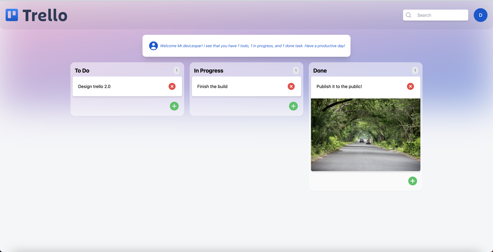

# Trello Clone with Next.js, Appwrite, and GPT Integration



This project is a feature-rich Trello clone built using the latest version of Next.js. It leverages Appwrite as its database, offering a seamless and powerful task management experience. Additionally, it integrates GPT to dynamically display the number of tasks in each column, enable a search feature, and intelligently filter and categorize related tasks.

## Table of Contents

- [Features](#features)
- [Setup](#setup)
  - [Prerequisites](#prerequisites)
  - [Environment Variables](#environment-variables)
  - [Running the Application](#running-the-application)
- [Usage](#usage)
- [Live Demo](#live-demo)
- [Contributing](#contributing)

## Features

- **Task Columns**: Organize your tasks into "To Do," "In Progress," and "Done" columns.
- **Dynamic Task Count**: The application intelligently counts and displays the number of tasks in each column.
- **Search Functionality**: Easily find tasks with the built-in search feature.
- **GPT Integration**: Leveraging GPT, related tasks are filtered and displayed in an intuitive way.

## Setup

### Prerequisites

Before running this application, make sure you have the following prerequisites installed on your local machine:

- [Node.js](https://nodejs.org/)
- [npm](https://www.npmjs.com/)
- [Appwrite Account](https://appwrite.io/) and your ChatGPT API key.

### Environment Variables

Create a `.env.local` file in the root directory of your project and populate it with the following variables:

```
NEXT_PUBLIC_APPWRITE_PROJECT_ID=
NEXT_PUBLIC_DATABASE_ID=
NEXT_PUBLIC_TODOS_COLLECTION_ID=
OPEN_API_KEY=
```

- `NEXT_PUBLIC_APPWRITE_PROJECT_ID`: Your Appwrite project ID.
- `NEXT_PUBLIC_DATABASE_ID`: The Appwrite database ID.
- `NEXT_PUBLIC_TODOS_COLLECTION_ID`: The collection ID for storing tasks.
- `OPEN_API_KEY`: Your ChatGPT API key.

### Running the Application

1. Clone this repository to your local machine:
```markdown
git clone https://github.com/yourusername/trello-clone.git
```
2. Navigate to the project folder
```
cd trello-clone
```
3. Install the required dependencies
```
npm install
```
4. Start the development server
```
npm run dev
```
5. Access the application in your web browser at `http://localhost:3000`.

## Usage

Feel free to use and customize this Trello clone to suit your project management needs. Add tasks, move them between columns, search for specific tasks, and take advantage of GPT-powered features for an enhanced experience.


## Live Demo

You can access the live demo of this Trello clone [here](https://trello-nextjs13.vercel.app/).

## Contributing

Contributions are welcome! If you'd like to contribute to this project, please follow these steps:

1. Fork the repository.
2. Create a new branch with a descriptive name.
3. Make your changes and commit them.
4. Push your changes to your fork.
5. Create a pull request with a clear description of your changes.


---

Happy task management with your Trello Clone! If you have any questions or need assistance, feel free to reach out.